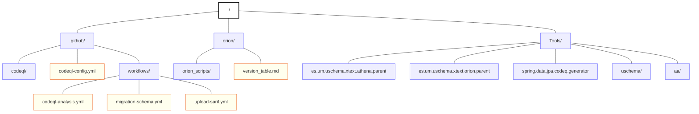

# Umugram

Este repositorio contiene la implementación completa del proyecto Umugram, que demuestra cómo realizar una integración continua con una herramienta predictora mediante el lenguaje Orion. También se proporciona un genererador de Orion a MySQL encargado de las migraciones de esquema.

# Mi proyecto

